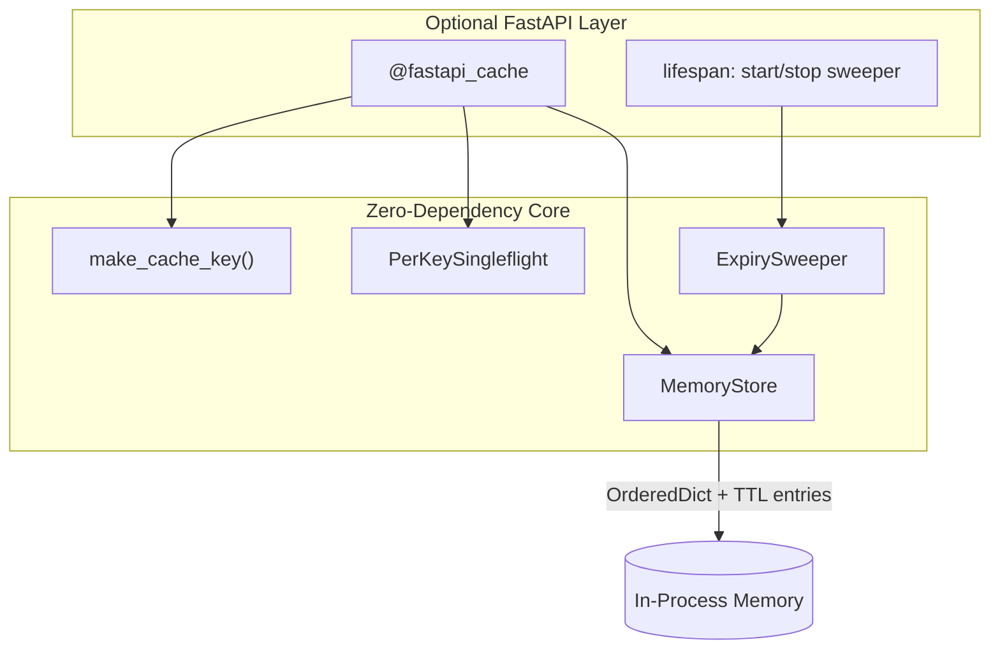

# inhouse

**Zero-dependency, in-process TTL cache for Python.** One decorator, stampede-safe, LRU-bounded. For when Redis is a meeting you don't want to have, or when you need to avoid yet another deployment. Designed to be simple and effective without bloat or complexity for developers.

Designed for easy use with FastAPI applications. Although FastAPI integration is absolutely optional.

## Install

The package is published on PyPI as **`inhouse-cache`**. Imports use `inhouse` (e.g. `from inhouse import MemoryStore`).

Core:
```bash
pip install inhouse-cache
```

With FastAPI helpers (`fastapi_cache`, lifespan sweeper):
```bash
pip install inhouse-cache[fastapi]
```

## Quick start Usage

### Core (any Python project)

```python
from inhouse import MemoryStore, inhouse_cache

store = MemoryStore(max_size=1024, default_ttl=60)


@inhouse_cache(store=store)
async def load_user(user_id: int) -> dict[str, int]:
    return {"user_id": user_id}
```

Works with both `async def` and `def` callables.

### FastAPI Use Case

```python
import asyncio

from fastapi import FastAPI

from inhouse import MemoryStore
from inhouse.fastapi import create_lifespan, fastapi_cache

store = MemoryStore(max_size=1024, default_ttl=60)
app = FastAPI(lifespan=create_lifespan(store))


@app.get("/items/{item_id}")
@fastapi_cache(store=store)
async def get_item(item_id: int) -> dict[str, int]:
    await asyncio.sleep(0.1)  # expensive work
    return {"item_id": item_id}
```

Requires `pip install inhouse-cache[fastapi]`.

## Features

**Core (zero dependencies)**

- TTL cache with lazy expiry on read
- LRU eviction when `max_size` is exceeded
- Per-key singleflight stampede guard - concurrent misses on the same key coalesce to one computation. Errors and cancellations propagate to all waiters (no hung followers on shutdown)
- Deterministic cache keys - canonical JSON serialization. Keyword argument order and Request subclasses don't cause spurious cache misses
- Thread-safe store for sync and async callables
- Fixed, store-default, or callable TTL on each cache write

**Optional FastAPI extra** (`pip install inhouse-cache[fastapi]`)

- `@fastapi_cache` with Request/Response-aware cache keys
- Background expiry sweeper via FastAPI lifespan helpers
- Clean lifespan shutdown - background sweeper cancels without noisy tracebacks

## Configuration reference

### `MemoryStore`

```python
from inhouse import MemoryStore

store = MemoryStore(max_size=1024, default_ttl=60)
```

| Parameter / attribute | Type | Default | Description |
|---|---|---|---|
| `max_size` | `int` | `1024` | Maximum number of entries before LRU eviction |
| `default_ttl` | `float \| None` | `None` | Default TTL in seconds for `store.set()` and decorators that omit `ttl_seconds` |
| `default_ttl` (property) | `float \| None` | — | Mutable at runtime; affects **future** writes only |
| `size` | `int` (read-only) | — | Current number of cached entries |

Store methods:

| Method | Description |
|---|---|
| `get(key, *, default=MISS)` | Return a cached value, or `default` on miss/expiry |
| `set(key, value, ttl_seconds=None)` | Write a value; uses `default_ttl` when `ttl_seconds` is omitted |
| `delete(key)` | Remove one entry |
| `clear()` | Remove all entries |
| `purge_expired()` | Proactively delete expired entries |
| `keys()` | List current cache keys |

### `@inhouse_cache` / `cache()`

Core decorator. Works with both `async def` and `def` callables.

```python
from inhouse import MemoryStore, inhouse_cache, make_cache_key

store = MemoryStore(default_ttl=60)

@inhouse_cache(
    ttl_seconds=60,          # optional — see Dynamic TTL below
    store=store,             # optional — defaults to a module-level store
    key_builder=make_cache_key,  # optional — custom cache key strategy
    exclude_types=(object,),     # optional — types omitted from key material
)
async def load_user(user_id: int) -> dict[str, int]:
    return {"user_id": user_id}
```

| Parameter | Type | Default | Description |
|---|---|---|---|
| `ttl_seconds` | `float \| Callable[[], float] \| None` | `None` | TTL in seconds for each cache write. See [Dynamic TTL](#dynamic-ttl). |
| `store` | `MemoryStore \| None` | module default | Cache instance to read/write |
| `key_builder` | `Callable[..., str]` | `make_cache_key` | Builds the cache key from function identity + arguments |
| `exclude_types` | `tuple[type, ...]` | `()` | Argument types excluded from key material (e.g. request objects) |

`inhouse_cache` is an alias for `cache`.

Global default store helpers:

```python
from inhouse import configure_default_store, get_default_store

store = MemoryStore(default_ttl=120)
configure_default_store(store)

@inhouse_cache()  # uses the configured default store + its default_ttl
async def load_config() -> dict[str, str]:
    ...
```

### `@fastapi_cache` *(optional — requires `inhouse-cache[fastapi]`)*

FastAPI-friendly wrapper around `inhouse_cache`. Automatically excludes Starlette `Request` and `Response` objects from cache keys.

```python
from inhouse.fastapi import create_lifespan, fastapi_cache

store = MemoryStore(max_size=512, default_ttl=60)
app = FastAPI(lifespan=create_lifespan(store, sweep_interval=30.0))

@app.get("/items/{item_id}")
@fastapi_cache(store=store)
async def get_item(item_id: int) -> dict[str, int]:
    ...
```

| Parameter | Type | Default | Description |
|---|---|---|---|
| `ttl_seconds` | `float \| Callable[[], float] \| None` | `None` | Same semantics as `@inhouse_cache` |
| `store` | `MemoryStore \| None` | module default | Cache instance to read/write |

`fastapi_cache` does not expose `key_builder` or `exclude_types`; it always uses the FastAPI-aware key builder.

### Lifespan / background cleanup *(optional — requires `inhouse-cache[fastapi]`)*

```python
from inhouse.fastapi import create_lifespan, inhouse_lifespan

# Option A: pass directly to FastAPI
app = FastAPI(lifespan=create_lifespan(store, sweep_interval=30.0))

# Option B: use inside your own lifespan
async with inhouse_lifespan(store, sweep_interval=30.0):
    ...
```

| Parameter | Type | Default | Description |
|---|---|---|---|
| `store` | `MemoryStore` | required | Store to sweep for expired entries |
| `sweep_interval` | `float` | `30.0` | Seconds between background purge runs |

## Dynamic TTL

TTL is resolved when a value is **written** to the cache (on a miss), not on every read. Changing TTL settings does not retroactively extend entries already stored.

Three ways to configure expiration:

### 1. Fixed TTL (per route)

```python
@inhouse_cache(60, store=store)
async def load_user(user_id: int) -> dict[str, int]:
    ...
```

Always expires 60 seconds after the value is cached.

### 2. Store default (mutable at runtime)

```python
store = MemoryStore(default_ttl=60)

@inhouse_cache(store=store)
async def load_config() -> dict[str, str]:
    ...

# Later - affects future cache writes only
store.default_ttl = 300
```

Omitting `ttl_seconds` on the decorator uses `store.default_ttl`. If both are missing, inhouse raises `ValueError`.

`store.default_ttl` is safe to change at runtime from other threads; new writes pick up the updated value atomically.

### 3. Callable TTL (evaluated on each write)

```python
settings = {"cache_ttl": 60}

@inhouse_cache(lambda: settings["cache_ttl"], store=store)
async def load_dashboard() -> dict[str, str]:
    ...

settings["cache_ttl"] = 300  # next cache miss uses 300 seconds
```

Useful for feature flags, config files, or environment-driven TTL without redeploying.

### Priority order

When a cache miss is written, TTL is resolved as:

1. Callable `ttl_seconds()` result, if a callable was passed
2. Fixed `ttl_seconds` float, if provided
3. `store.default_ttl`, if set
4. Otherwise → `ValueError`

## When to use inhouse

| Scenario | inhouse | Redis | fastapi-cache2 |
|---|---|---|---|
| Single-node FastAPI prototype | Great | Overkill | Great |
| Zero external infrastructure | Yes | No | Depends on backend |
| Distributed multi-instance cache | No | Yes | Yes (with Redis) |
| Decorator-first developer UX | Yes | No | Yes |

## Important limitations

inhouse is **per-process** memory. If you run `uvicorn main:app --workers 4`, each worker maintains its own independent cache. That keeps the design simple and avoids shared infrastructure. It is not a distributed cache.

## Architecture



## Core API

The core package has no runtime dependencies. Import from `inhouse` directly:

```python
from inhouse import MemoryStore, configure_default_store, inhouse_cache, make_cache_key
```

See [Configuration reference](#configuration-reference) for full decorator and store options.

## License

MIT
