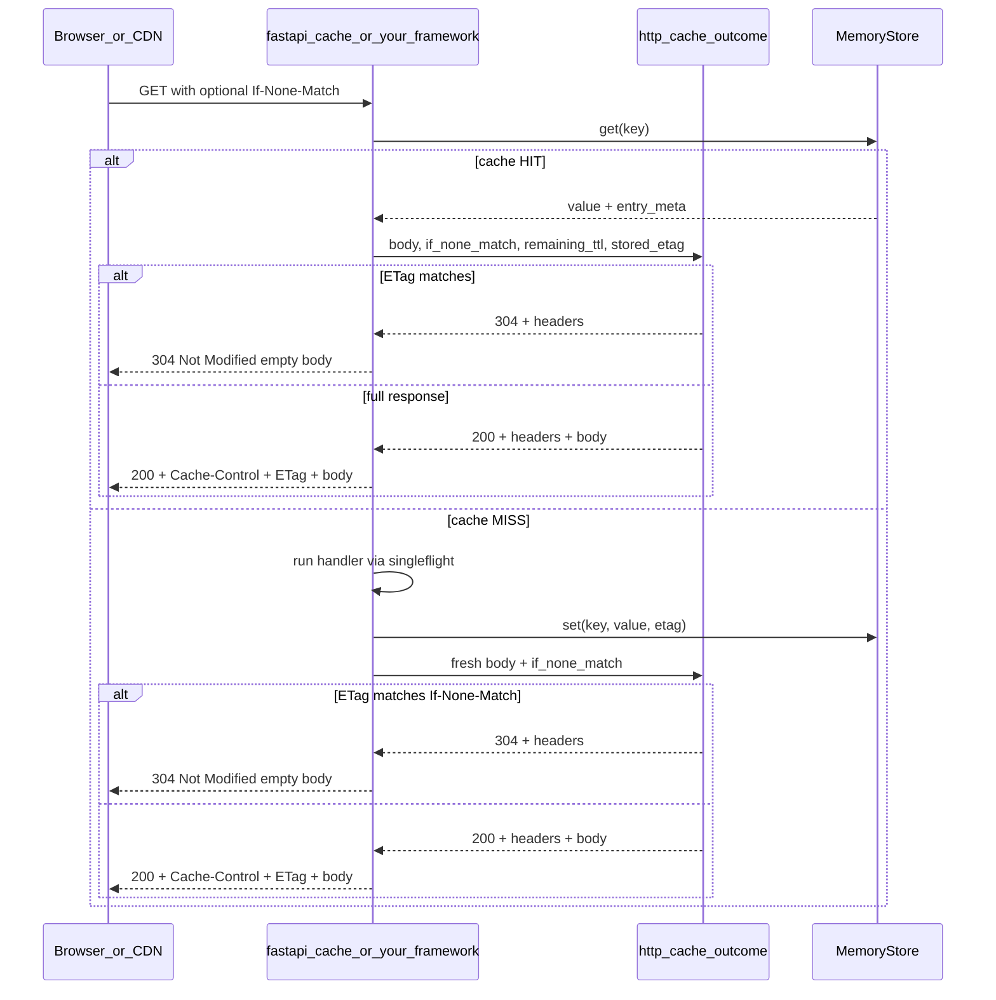
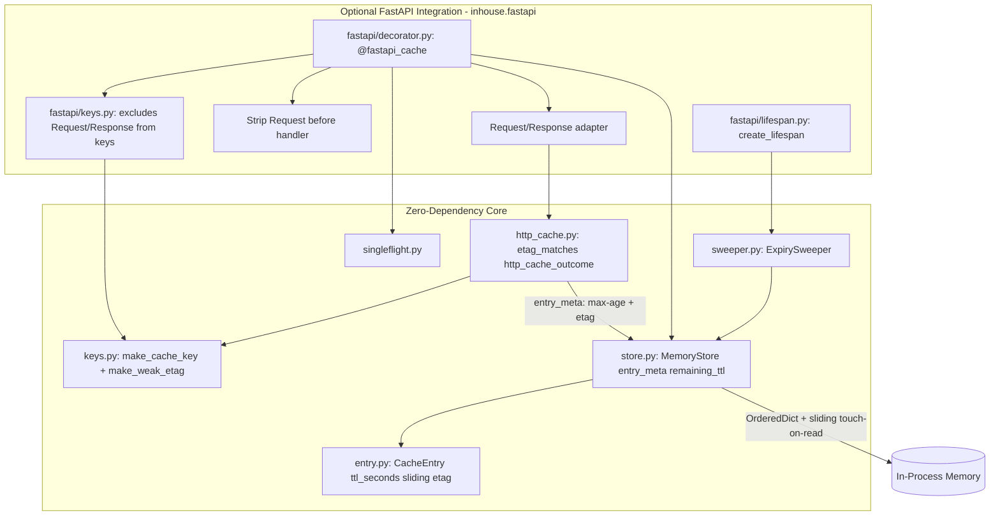

# inhouse

**Zero-dependency, in-process TTL cache for Python.** One decorator, stampede-safe, LRU-bounded. For when Redis is a meeting you don't want to have, or when you need to avoid yet another deployment. Designed to be simple and effective without bloat or complexity for developers.

**Keep hot data cheap to serve** — v0.2.x adds an optional HTTP layer (memory → `Cache-Control` / ETag) with sensible defaults and no breaking changes.

Designed for easy use with FastAPI applications. Although FastAPI integration is absolutely optional.

### Official Documentation/Release Notice:
Complete documentation by version is now managed by Rancero, and is available at https://docs.rancero.com/docs/category/inhouse-cache.

## Install

The package is published on PyPI as **`inhouse-cache`**. Imports use `inhouse` (e.g. `from inhouse import MemoryStore`).

Core:
```bash
pip install inhouse-cache
```

With FastAPI helpers (`fastapi_cache`, lifespan sweeper):
```bash
pip install inhouse-cache[fastapi]
```

## Quick start Usage

### Core (any Python project)

```python
from inhouse import MemoryStore, inhouse_cache

store = MemoryStore(max_size=1024, default_ttl=60)


@inhouse_cache(store=store)
async def load_user(user_id: int) -> dict[str, int]:
    return {"user_id": user_id}
```

### Core with HTTP cache metadata (v0.2.1)

```python
from inhouse import MemoryStore, http_cache_outcome, inhouse_cache, make_cache_key

store = MemoryStore(max_size=1024, default_ttl=60)


@inhouse_cache(60, store=store, etag=True)
async def load_catalog(item_id: int) -> dict[str, int]:
    return {"item_id": item_id}


# framework-agnostic conditional response (Flask, Django, raw ASGI, etc.)
body = await load_catalog(1)
cache_key = make_cache_key(load_catalog, (1,), {})
outcome = http_cache_outcome(
    body,
    if_none_match=client_if_none_match,  # from request headers
    remaining_ttl=store.remaining_ttl(cache_key),
    stored_etag=store.get_etag(cache_key),
    http_cache=True,
    cache_visibility="public",
    use_etag=True,
)
# outcome.status_code, outcome.headers, outcome.body → wire into your framework
```

Works with both `async def` and `def` callables.

### FastAPI Use Case

```python
import asyncio

from fastapi import FastAPI

from inhouse import MemoryStore
from inhouse.fastapi import create_lifespan, fastapi_cache

store = MemoryStore(max_size=1024, default_ttl=60)
app = FastAPI(lifespan=create_lifespan(store))


@app.get("/items/{item_id}")
@fastapi_cache(store=store)
async def get_item(item_id: int) -> dict[str, int]:
    await asyncio.sleep(0.1)  # expensive work
    return {"item_id": item_id}
```

Requires `pip install inhouse-cache[fastapi]`.

### FastAPI with HTTP caching (v0.2.0)

```python
@app.get("/catalog/{item_id}")
@fastapi_cache(
    60,
    store=store,
    sliding=True,
    http_cache=True,
    etag=True,
    cache_visibility="public",
)
async def get_catalog_item(item_id: int) -> dict[str, int]:
    await asyncio.sleep(0.1)
    return {"item_id": item_id}
```

## Features

**Core (zero dependencies)**

- TTL cache with lazy expiry on read
- **Sliding TTL (v0.2.0)** — opt-in touch-on-read extends active entry lifetimes; idle entries still expire
- LRU eviction when `max_size` is exceeded
- Per-key singleflight stampede guard - concurrent misses on the same key coalesce to one computation. Backend errors propagate to all waiters; client disconnect on the leader no longer aborts in-flight cache population for followers
- Deterministic cache keys - canonical JSON serialization with type-qualified fallbacks for custom objects. Keyword argument order and Request subclasses don't cause spurious cache misses
- Thread-safe store for sync and async callables
- Fixed, store-default, or callable TTL on each cache write
- Opt-in `copy_on_read` on `MemoryStore` — deep-copy cached values on read to prevent caller mutation from corrupting the cache
- **`remaining_ttl()` (v0.2.0)** — introspect seconds-until-expiry for a cached key
- **HTTP cache primitives (v0.2.1)** — framework-agnostic helpers in `inhouse.http_cache`: weak ETag generation (`make_weak_etag`), `etag_matches`, `cache_control_header`, `http_cache_headers`, and `http_cache_outcome` (304 vs 200 decision + header dict)
- **`@inhouse_cache(etag=True)` (v0.2.1)** — store a stable weak ETag alongside cached values at write time (no HTTP response objects; wire headers yourself or use a framework extra)

**Optional FastAPI extra** (`pip install inhouse-cache[fastapi]`)

- `@fastapi_cache` with Request/Response-aware cache keys
- **Automatic HTTP wiring (v0.2.0, core-backed v0.2.1)** — `http_cache=True` and/or `etag=True` read `If-None-Match` from the injected `Request` and return native Starlette `JSONResponse` / `304 Response` using core `http_cache_outcome`
- Background expiry sweeper via FastAPI lifespan helpers
- Clean lifespan shutdown - background sweeper cancels without noisy tracebacks

## Configuration reference

### `MemoryStore`

```python
from inhouse import MemoryStore

store = MemoryStore(max_size=1024, default_ttl=60, sliding=False)
```

| Parameter / attribute | Type | Default | Description |
|---|---|---|---|
| `max_size` | `int` | `1024` | Maximum number of entries before LRU eviction |
| `default_ttl` | `float \| None` | `None` | Default TTL in seconds for `store.set()` and decorators that omit `ttl_seconds` |
| `copy_on_read` | `bool` | `False` | When `True`, `get()` returns `copy.deepcopy()` of cached values so callers cannot mutate the store |
| `sliding` | `bool` | `False` | Store-wide default for touch-on-read TTL extension on `set()` |
| `sliding` (property) | `bool` | — | Read-only; current store-wide sliding default |
| `default_ttl` (property) | `float \| None` | — | Mutable at runtime; affects **future** writes only |
| `size` | `int` (read-only) | — | Current number of cached entries |

Store methods:

| Method | Description |
|---|---|
| `get(key, *, default=MISS)` | Return a cached value, or `default` on miss/expiry. Extends expiry on read when entry is sliding. Deep-copies when `copy_on_read=True` |
| `set(key, value, ttl_seconds=None, *, sliding=None, etag=None)` | Write a value; uses `default_ttl` when `ttl_seconds` is omitted. `sliding=None` inherits store default |
| `remaining_ttl(key)` | Seconds until expiry for a live entry, or `None` on miss/expired |
| `entry_meta(key)` | `(remaining_ttl, etag)` tuple for a live entry, or `None` — single lock hop for HTTP header assembly |
| `get_etag(key)` | Stored ETag for a live entry, or `None` |
| `delete(key)` | Remove one entry |
| `clear()` | Remove all entries |
| `purge_expired()` | Proactively delete expired entries |
| `keys()` | List current cache keys |

### `@inhouse_cache` / `cache()`

Core decorator. Works with both `async def` and `def` callables.

```python
from inhouse import MemoryStore, inhouse_cache, make_cache_key

store = MemoryStore(default_ttl=60)

@inhouse_cache(
    ttl_seconds=60,          # optional — see Dynamic TTL below
    store=store,             # optional — defaults to a module-level store
    key_builder=make_cache_key,  # optional — custom cache key strategy
    exclude_types=(object,),     # optional — types omitted from key material
    sliding=False,           # optional — touch-on-read TTL extension
    etag=False,              # optional — store weak ETag metadata at write time
)
async def load_user(user_id: int) -> dict[str, int]:
    return {"user_id": user_id}
```

| Parameter | Type | Default | Description |
|---|---|---|---|
| `ttl_seconds` | `float \| Callable[[], float] \| None` | `None` | TTL in seconds for each cache write. See [Dynamic TTL](#dynamic-ttl). |
| `store` | `MemoryStore \| None` | module default | Cache instance to read/write |
| `key_builder` | `Callable[..., str]` | `make_cache_key` | Builds the cache key from function identity + arguments. Non-JSON-serializable arguments fall back to `module.qualname:str(value)` |
| `exclude_types` | `tuple[type, ...]` | `()` | Argument types excluded from key material (e.g. request objects) |
| `sliding` | `bool` | `False` | When `True`, each successful read extends expiry by the entry's stored TTL duration |
| `etag` | `bool` | `False` | When `True`, store a weak ETag (`W/"<sha256>"`) at write time via `make_weak_etag`. Retrieve with `store.get_etag(key)` or `store.entry_meta(key)` |

`inhouse_cache` is an alias for `cache`.

### HTTP cache primitives *(core — zero dependencies, v0.2.1)*

Core owns HTTP **semantics** (ETag digests, `If-None-Match` matching, `Cache-Control` header values, 304 vs 200 decisions). It does not return framework response objects — adapters wire `HttpCacheOutcome` into your stack.

```python
from inhouse import (
    HttpCacheOutcome,
    cache_control_header,
    etag_matches,
    http_cache_headers,
    http_cache_outcome,
    make_weak_etag,
)

tag = make_weak_etag({"id": 1})                    # W/"<sha256>"
etag_matches('W/"abc", W/"other"', 'W/"abc"')     # True
cache_control_header(30.5, visibility="public")    # "public, max-age=31"

outcome: HttpCacheOutcome = http_cache_outcome(
    body,
    if_none_match=client_if_none_match,
    remaining_ttl=42.0,
    stored_etag=tag,
    http_cache=True,
    cache_visibility="private",
    use_etag=True,
)
# outcome.status_code → 200 or 304
# outcome.headers     → {"Cache-Control": ..., "ETag": ...}
# outcome.body        → body on 200, None on 304
```

Use with `MemoryStore.set(..., etag=...)`, `@inhouse_cache(etag=True)`, or manual `make_weak_etag` at write time. Pair with `store.remaining_ttl()` / `store.entry_meta()` when assembling headers on cache hits.

Global default store helpers:

```python
from inhouse import configure_default_store, get_default_store

store = MemoryStore(default_ttl=120)
configure_default_store(store)

@inhouse_cache()  # uses the configured default store + its default_ttl
async def load_config() -> dict[str, str]:
    ...
```

### Sliding TTL

Fixed TTL expires on an absolute deadline set at write time. **Sliding TTL** extends that deadline on every successful read by the entry's stored TTL duration — so frequently accessed data stays warm while idle data still expires naturally.

```python
@inhouse_cache(60, store=store, sliding=True)
async def load_active_session(session_id: str) -> dict[str, str]:
    ...
```

**Why use it:** active user sessions, hot configuration, or any data accessed repeatedly within a window should stay cached without arbitrary mid-activity expiry.

**Caveat:** a continuously read key can live indefinitely until LRU eviction at `max_size`. Callable TTL is still evaluated on write only; sliding reuses the duration stored at the last write.

### `@fastapi_cache` *(optional — requires `inhouse-cache[fastapi]`)*

FastAPI-friendly wrapper around `inhouse_cache`. Automatically excludes Starlette `Request` and `Response` objects from cache keys.

```python
from inhouse.fastapi import create_lifespan, fastapi_cache

store = MemoryStore(max_size=512, default_ttl=60)
app = FastAPI(lifespan=create_lifespan(store, sweep_interval=30.0))

@app.get("/items/{item_id}")
@fastapi_cache(store=store)
async def get_item(item_id: int) -> dict[str, int]:
    ...
```

| Parameter | Type | Default | Description |
|---|---|---|---|
| `ttl_seconds` | `float \| Callable[[], float] \| None` | `None` | Same semantics as `@inhouse_cache` |
| `store` | `MemoryStore \| None` | module default | Cache instance to read/write |
| `key_builder` | `Callable[..., str] \| None` | `make_fastapi_cache_key` | Custom key builder. Defaults exclude Starlette `Request`/`Response`; override delegates that responsibility to you |
| `sliding` | `bool` | `False` | Touch-on-read TTL extension (same as `@inhouse_cache`) |
| `http_cache` | `bool` | `False` | Emit `Cache-Control` with `max-age` from remaining in-process TTL |
| `cache_visibility` | `"private" \| "public"` | `"private"` | Cache-Control visibility. Use `"public"` only for CDN/browser-shared assets |
| `etag` | `bool` | `False` | Generate stable ETag, handle `If-None-Match` / `304 Not Modified` via core `http_cache_outcome`, return Starlette responses |

Custom `key_builder` functions replace the FastAPI-aware default. To keep Request/Response exclusion, delegate to `make_fastapi_cache_key` or pass your own `exclude_types`.

When `http_cache=False` and `etag=False`, behavior is identical to v0.1.x (returns plain Python objects, no HTTP headers). With only `etag=True` on `@inhouse_cache` (no FastAPI), values are cached with ETag metadata but no HTTP responses are emitted.

FastAPI-injected `request` is used only to read `If-None-Match`; it is stripped before your route handler runs and excluded from cache keys via `make_fastapi_cache_key`.

### HTTP caching

v0.1.x optimized the **server** (in-process TTL, stampede guard, LRU). v0.2.0 added HTTP caching via `@fastapi_cache`; v0.2.1 moves the semantics into core so any framework can use them. The FastAPI extra remains a thin adapter that reads `Request` headers and returns Starlette `Response` objects.

**Three complementary layers:**

| Layer | Mechanism | What it saves |
|---|---|---|
| 1. In-process cache | `@inhouse_cache` / `@fastapi_cache` / `MemoryStore` | Server compute on repeat hits |
| 2. Time-based HTTP cache | `http_cache=True` → `Cache-Control: max-age=N` | The round trip entirely while fresh |
| 3. Conditional HTTP cache | `etag=True` → `If-None-Match` / `304` | The response payload when the round trip happens anyway |

**HTTP Cache-Control (`http_cache=True`)**

Offloads execution load entirely. If a client browser or a CDN (like Cloudflare) sees a valid `Cache-Control: public, max-age=30` header, they won't even send the request to your server — saving bandwidth and compute.

- `max-age` is derived from `store.remaining_ttl(key)` on cache hits, so HTTP freshness tracks in-process TTL (including sliding extensions)
- Defaults to `Cache-Control: private, max-age=N` — safe for user-specific responses
- Opt in to `cache_visibility="public"` for CDN-shared public assets
- Core helper: `cache_control_header()` / `http_cache_headers()`

**ETag / 304 Not Modified (`etag=True`)**

When a client already has the current version, inhouse returns `304 Not Modified` with an empty body instead of re-serializing and re-transmitting the full response — a huge bandwidth win on repeat requests.

- Stable weak ETag (`W/"<sha256>"`) computed at cache-write time via canonical JSON digest (`make_weak_etag`)
- `@inhouse_cache(etag=True)` stores the tag; `@fastapi_cache(etag=True)` also handles conditional requests automatically
- `If-None-Match` handled on cache hits and misses (recompute + matching ETag still skips body transfer)
- Pairs naturally with Cache-Control: the browser/CDN may skip the request entirely; if a conditional request arrives after expiry, 304 skips the payload
- Core helper: `etag_matches()` / `http_cache_outcome()`



**FastAPI return types:** `http_cache` / `etag` modes return Starlette `JSONResponse` or `304 Response`. Best suited to JSON-serializable dict/list/Pydantic returns. Routes returning custom `Response` subclasses should omit `http_cache` / `etag`.

**Other frameworks:** use core `http_cache_outcome` with your own request header reads and response types — same semantics, no FastAPI import required.

### Lifespan / background cleanup *(optional — requires `inhouse-cache[fastapi]`)*

```python
from inhouse.fastapi import create_lifespan, inhouse_lifespan

# Option A: pass directly to FastAPI
app = FastAPI(lifespan=create_lifespan(store, sweep_interval=30.0))

# Option B: use inside your own lifespan
async with inhouse_lifespan(store, sweep_interval=30.0):
    ...
```

| Parameter | Type | Default | Description |
|---|---|---|---|
| `store` | `MemoryStore` | required | Store to sweep for expired entries |
| `sweep_interval` | `float` | `30.0` | Seconds between background purge runs |

## Dynamic TTL

TTL is resolved when a value is **written** to the cache (on a miss), not on every read. Changing TTL settings does not retroactively extend entries already stored.

With **sliding TTL**, successful reads extend expiry by the TTL duration stored at the last write (not by re-evaluating a callable TTL).

Three ways to configure expiration:

### 1. Fixed TTL (per route)

```python
@inhouse_cache(60, store=store)
async def load_user(user_id: int) -> dict[str, int]:
    ...
```

Always expires 60 seconds after the value is cached (unless `sliding=True` extends it on read).

### 2. Store default (mutable at runtime)

```python
store = MemoryStore(default_ttl=60)

@inhouse_cache(store=store)
async def load_config() -> dict[str, str]:
    ...

# Later - affects future cache writes only
store.default_ttl = 300
```

Omitting `ttl_seconds` on the decorator uses `store.default_ttl`. If both are missing, inhouse raises `ValueError`.

`store.default_ttl` is safe to change at runtime from other threads; new writes pick up the updated value atomically.

### 3. Callable TTL (evaluated on each write)

```python
settings = {"cache_ttl": 60}

@inhouse_cache(lambda: settings["cache_ttl"], store=store)
async def load_dashboard() -> dict[str, str]:
    ...

settings["cache_ttl"] = 300  # next cache miss uses 300 seconds
```

Useful for feature flags, config files, or environment-driven TTL without redeploying.

### Priority order

When a cache miss is written, TTL is resolved as:

1. Callable `ttl_seconds()` result, if a callable was passed
2. Fixed `ttl_seconds` float, if provided
3. `store.default_ttl`, if set
4. Otherwise → `ValueError`

## When to use inhouse

| Scenario | inhouse | Redis | fastapi-cache2 |
|---|---|---|---|
| Single-node FastAPI prototype | Great | Overkill | Great |
| Zero external infrastructure | Yes | No | Depends on backend |
| Distributed multi-instance cache | No | Yes | Yes (with Redis) |
| Decorator-first developer UX | Yes | No | Yes |
| Browser/CDN HTTP caching (v0.2.0) | Yes (opt-in) | No | Depends on backend |

## Important limitations

inhouse is **per-process** memory. If you run `uvicorn main:app --workers 4`, each worker maintains its own independent cache. That keeps the design simple and avoids shared infrastructure. It is not a distributed cache.

**HTTP cache independence (v0.2.0):** in-process TTL and HTTP `Cache-Control` / ETag freshness are related but not identical. Calling `store.delete()` or waiting for in-process expiry does **not** invalidate browser or CDN copies. Plan HTTP cache durations and invalidation accordingly.

## Architecture



## Core API

The core package has no runtime dependencies. Import from `inhouse` directly:

```python
from inhouse import (
    HttpCacheOutcome,
    MemoryStore,
    cache_control_header,
    configure_default_store,
    etag_matches,
    http_cache_headers,
    http_cache_outcome,
    inhouse_cache,
    make_cache_key,
    make_weak_etag,
)
```

See [Configuration reference](#configuration-reference) for full decorator and store options.

## License

MIT
